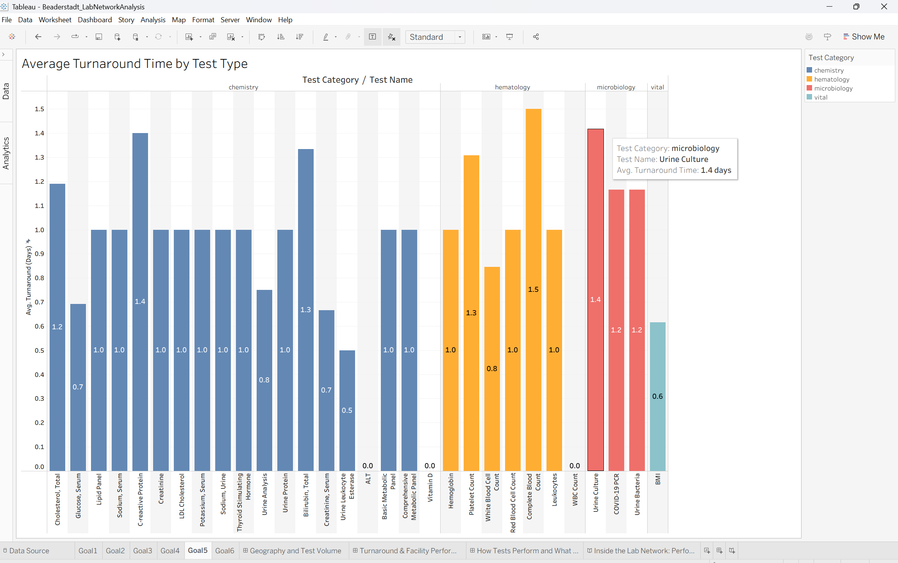
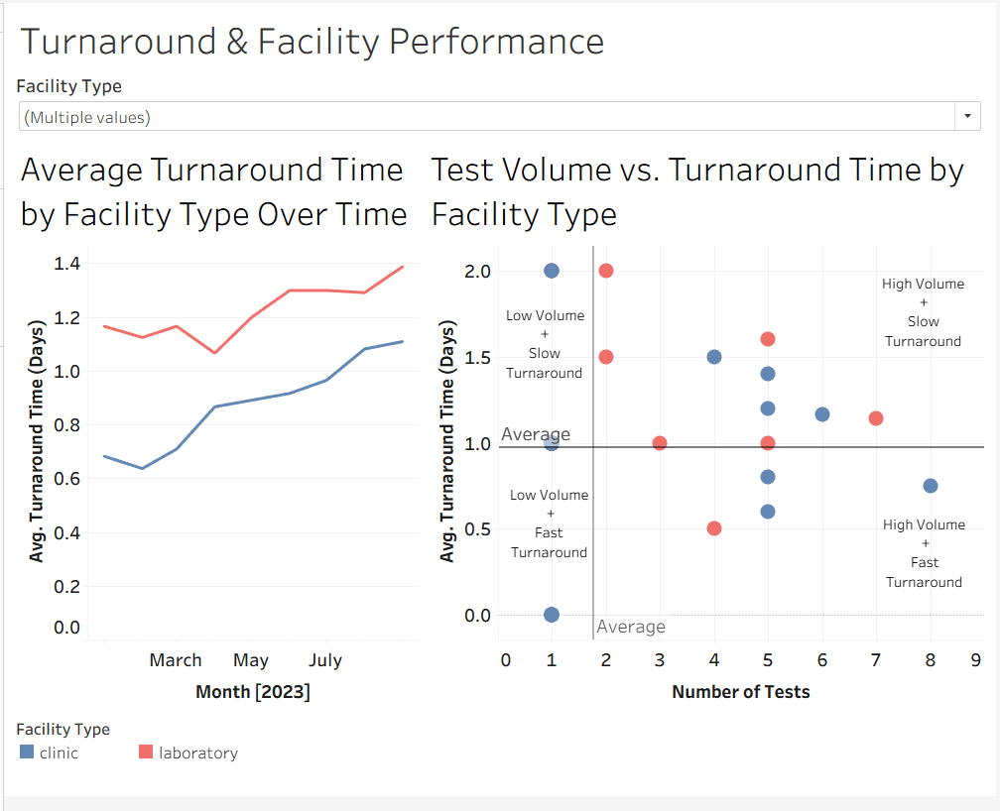

# Inside the Lab Network: Performance, Volume, and Cost Across Facilities
Alissa Beaderstadt
February 10, 2026

## Section 1. Introduction 
Clinical laboratories play a huge role in healthcare operations. They have to balance speed, testing volume, and cost, all while supporting patient care. In this project, I took a closer look at how a lab network performs across different locations, facility types, and test categories.
Using a simulated healthcare lab operations dataset, I explored where labs are located, how much testing they handle, how quickly results are completed, and how costs compare to reimbursement.
The goal of this analysis was to identify patterns that could actually matter for operational decision making. By combining geographic views, trend analysis, and cost comparisons in Tableau, this project highlights where labs appear to be operating efficiently and where there may be room for improvement.

You can view my interactive Tableau project here:
https://public.tableau.com/views/Beaderstadt_LabNetworkAnalysis/Goal1?:language=en-US&:sid=&:redirect=auth&:display_count=n&:origin=viz_share_link

## Section 2. Data Description  
## Data Domain
This dataset contains information about clinical laboratory testing performed across multiple facilities. It includes lab locations, facility types, test orders, turnaround times, test categories, and financial metrics such as cost and reimbursement.
## Data File
The data comes from an Excel file named healthcare-lab-test-utilization.xlsx. It is a simulated lab operations dataset sourced from GoMask.ai, an AI-powered test data management platform that generates realistic, compliant healthcare data.
The dataset contains 200 rows and 29 original columns. I created one additional calculated column, Turnaround Time (Days), by calculating the difference between the Test Order Date and the Test Completed Date.
The following columns were present and clean upon obtaining the file:
-	utilization_id
-	facility_id
-	facility_name
-	facility_type
-	facility_street_address
-	facility_city
-	facility_state
-	facility_postal_code
-	facility_country
- test_order_id
- test_code
-	test_name
-	test_category
-	test_order_date
-	test_completed_date	
-	ordering_physician_id	
-	ordering_physician_name
-	patient_id
-	patient_age
-	patient_gender
-	test_result_value
-	test_result_unit
-	test_result_flag
-	test_cost
-	test_reimbursed_amount
-	test_utilization_status
-	test_duplicate_flag
-	diagnosis_code	
-	diagnosis_description 

## Rows and Columns Used
All 200 rows are included in this analysis. After adding the calculated turnaround time column, the dataset contains 30 columns total. Of these, 12 columns were actively used in the visualizations.
## Data Source
The dataset is a simulated lab operations dataset sourced from GoMask.ai. It represents lab testing activity across states, facility types, and test categories, and includes metrics related to turnaround time, testing volume, and financial performance.

You can view my data source here: 
https://gomask.ai/marketplace/datasets/healthcare-lab-test-utilization

## Section 3. Data Cleaning Strategies 
Very little cleaning was required for this project. State values were updated from abbreviations to full state names to improve readability and consistency in the geographic visualization. Other than that, the dataset was already well structured and ready to use.

## Section 4. Clean Dataset 
The clean dataset includes all original records, along with standardized state names and the calculated turnaround time column.
The data is structured at the individual test order level, which allows for analysis by facility, location, test type, and date. 

## Section 5. Visualization Tools 
Tableau was selected as the primary visualization tool because it supports interactive dashboards, geographic mapping, and clear comparisons across multiple dimensions such as location, facility type, and test category.
Its filtering and storytelling features made it the best choice for exploring patterns and communicating insights in a way that is easy to follow.

## Section 6. Visualizations and Stories
This section presents dashboards and charts that explore lab performance across locations, facility types, and test categories.
You can interact with the filters to explore results by state, facility type, or test type. Below, I’ve included screenshots and short explanations to highlight key takeaways. The full interactive Tableau workbook is available online if you would like to explore the data.

### Goal 1: Where are labs located, and how is testing activity distributed across states?
*Story:* Facilities are spread across several U.S. states and two Canadian provinces. The states with the most facilities are California, Colorado, and Wyoming. Bigger circles represent more lab facilities, and darker blue shades show higher test volumes, which makes sense since more labs tend to process more tests.

 
### Goal 2: How do average turnaround times differ by facility type, and how have they changed over time?
*Story:* These values use a moving average to smooth out month-to-month ups and downs. Overall, laboratories have the highest average turnaround times throughout 2023, which is somewhat surprising given that labs are dedicated to test processing. This may reflect higher test volumes or more complex testing handled by labs. 

 
### Goal 3: How does test volume by facility type relate to turnaround time?
*Story:* Generally, higher test volumes come with slower turnaround times. That said, seven facilities manage high volume while keeping turnaround fast  showing they’ve got efficient processes in place. On the flip side, two low-volume clinics are slower than average, which could be a spot to focus on for improvement.

### Goal 4: What percentage of total testing does each test type represent, and which tests are ordered most frequently?
*Story:* BMI is the most commonly ordered test at 13.0%, with Cholesterol coming in second at 10.5%. Some other tests get ordered more often than others, but almost half of all testing is spread across a variety of types. No single test really dominates the labs’ workload. 

### Goal 5: How does turnaround time vary by test type, and which tests take longer?
*Story:* Complete Blood Count takes the longest on average at 1.5 days. ALT, Vitamin D, and WBC Count are much faster, close to zero days. Most tests hover around a 1-day average, which is a good sign for overall lab performance. Microbiology tests tend to be a bit slower than the rest of the categories.

### Goal 6: How do test costs compare to reimbursed amounts, and which tests appear to be the least cost effective?
*Story:* Across all test types, reimbursement is higher than cost, so overall the labs appear to be profitable. That said, not all tests perform the same. BMI, Red Blood Cell Count, and White Blood Cell Count have the smallest margins, making them the least cost-effective. On the other hand, COVID-19 PCR stands out as the most profitable test based on the size of its reimbursement gap.

## Dashboard Overview: Filters and Interactivity
These dashboards allow filtering by state, facility type, and test type to explore the data interactively. Screenshots above show each goal-specific chart in a clean view for clarity.

*Purpose:* Looking at these views together shows how lab locations and testing volume vary geographically. Filtering by state highlight’s location differences, while filtering by test type shows how tests are distributed across the lab network.

*Purpose:* Looking at these views together shows how turnaround time relates to facility type and test volume. Filtering by facility type lets you focus on one type at a time, revealing trends over time and the relationship between volume and turnaround for that group.

 
 
*Purpose:* Looking at these views together shows how turnaround time and cost efficiency vary by test type. Some tests combine fast turnaround with smaller reimbursement gaps, while others take longer and show larger gaps. Together, these metrics highlight which tests could benefit most from operational or pricing improvements. Overall, these views give a comprehensive look at lab performance, efficiency, and cost-effectiveness across the network.

### Section 7.  Conclusions 
Lab performance clearly varies by location, facility type, and test category. States with more labs tend to process higher testing volumes, but higher volume does not always mean faster results. In fact, some high-volume labs experience slower turnaround times, while a few manage to handle large workloads efficiently. Those high-performing labs may offer useful benchmarks for best practices across the network.
Turnaround time also depends heavily on test type. Most routine tests are completed within about a day, while more specialized tests take longer. From a financial perspective, reimbursement exceeds cost for all tests in this dataset, indicating overall profitability. However, not all tests are equally cost-effective. Tests such as BMI, Red Blood Cell Count, and White Blood Cell Count show smaller reimbursement-to-cost margins, while COVID-19 PCR demonstrates the largest financial margin.
Overall, this analysis highlights several practical opportunities. Slower labs may benefit from workflow review, efficient high-volume labs can serve as performance models, and test-specific financial margins should be considered when evaluating pricing or operational strategies. Together, these insights provide a clearer picture of how the lab network is performing and where targeted improvements could make the greatest impact.

# lab-network-analysis
